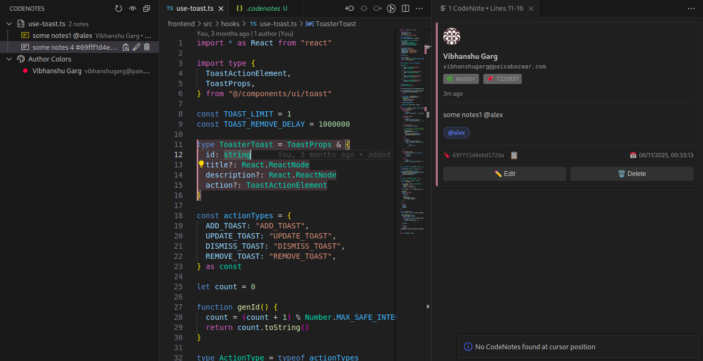
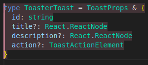
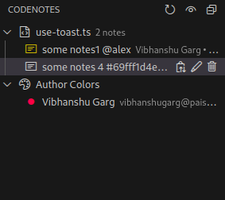
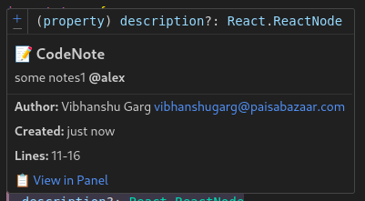

# CodeNotes

**Add contextual notes directly in your code with multi-author support, Git integration, and smart code-aware relocation.**


[](https://marketplace.visualstudio.com/items?itemName=codenotes.codenotes)
[](https://github.com/vibhanshu2001/codenotes)
[](https://github.com/vibhanshu2001/codenotes/issues)

---

## 📸 Demo



*See CodeNotes in action: Add notes, view highlights, and collaborate seamlessly.*

---

## 🎯 What is CodeNotes?

CodeNotes lets you add contextual notes directly in your code files. Notes stay attached to code even after edits, support multi-author collaboration, and integrate with Git for automatic author tracking.

**Perfect for:**
- ✏️ Code reviews and feedback
- 👥 Team collaboration
- 📚 Inline documentation
- 🐛 Bug tracking and notes
- 💡 Learning and explanations

---

## ✨ Key Features

### 🚀 **Quick & Easy**
- **One-click adding**: Select code → Press `Ctrl+Shift+N` → Done!
- **Inline highlights**: See notes at a glance with soft background colors
- **Hover tooltips**: Quick preview without leaving your code

### 👥 **Multi-Author Support**
- **Author tracking**: Each note shows who created it
- **Color coding**: Different authors get different highlight colors
- **Git integration**: Automatically uses Git user name/email
- **Avatars**: Visual author identification in sidebar

### 🧠 **Smart Features**
- **Code-aware relocation**: Notes stay attached even when code moves
- **Diff-aware**: Warns when code changes and note may be outdated
- **Function detection**: Automatically detects enclosing function/class
- **Git context**: Captures branch and commit hash automatically

### 💬 **Collaboration Features**
- **Mentions**: Tag team members with `@username`
- **Note linking**: Reference other notes with `#noteId`
- **Author permissions**: Only authors can edit/delete their own notes

### 📊 **Organization**
- **Sidebar view**: Dedicated panel with all notes organized by file
- **Color legend**: See all authors and their colors at a glance
- **Search & filter**: Quickly find notes across your codebase

---

## 🚀 Quick Start

### Installation

1. **Open VS Code**
2. **Go to Extensions** (`Ctrl+Shift+X` / `Cmd+Shift+X`)
3. **Search**: Type "CodeNotes"
4. **Install**: Click the Install button
5. **Reload**: Restart VS Code if prompted

### Your First CodeNote (30 seconds)

1. **Select code** in any file
2. **Press** `Ctrl+Shift+N` (or `Cmd+Shift+N` on Mac)
3. **Type** your note
4. **Done!** Your note is now attached to that code

**That's it!** The code will be highlighted, and you can hover to see your note.

---

## 📖 How to Use

### ⌨️ Keyboard Shortcuts

| Action | Windows/Linux | Mac |
|--------|---------------|-----|
| Add CodeNote | `Ctrl+Shift+N` | `Cmd+Shift+N` |
| Edit CodeNote | `Ctrl+Shift+E` | `Cmd+Shift+E` |
| Delete CodeNote | `Ctrl+Shift+D` | `Cmd+Shift+D` |
| View CodeNotes | `Ctrl+Shift+V` | `Cmd+Shift+V` |

### ➕ Adding a CodeNote

**Method 1: Keyboard Shortcut**
1. Select the code you want to annotate
2. Press `Ctrl+Shift+N`
3. Enter your note text
4. Press Enter

**Method 2: Right-Click Menu**
1. Select code
2. Right-click → "Add CodeNote"
3. Enter your note

**Method 3: Code Lens**
1. Select code
2. Click the `+` button that appears
3. Enter your note

**Pro Tips:**
- Use `@username` to mention team members
- Use `#noteId` to link to other notes
- Notes work for single lines or multi-line ranges

### ✏️ Editing a CodeNote

**At Cursor:**
- Place cursor on a note → Press `Ctrl+Shift+E`

**From Sidebar:**
- Click the edit icon (✏️) next to any note you created

**From Panel:**
- Press `Ctrl+Shift+V` → Click "Edit" button

> **Note**: You can only edit your own CodeNotes.

### 🗑️ Deleting a CodeNote

**At Cursor:**
- Place cursor on your note → Press `Ctrl+Shift+D`

**From Sidebar:**
- Click the delete icon (🗑️) next to your note

**From Panel:**
- Press `Ctrl+Shift+V` → Click "Delete" button

> **Note**: You can only delete your own CodeNotes.

### 👀 Viewing CodeNotes

**Three Ways to View:**

1. **Hover**: Hover over highlighted code to see note preview
2. **Sidebar**: Click CodeNotes icon in activity bar (left side)
3. **Panel**: Press `Ctrl+Shift+V` to see all notes at cursor position

**In Sidebar:**
- Notes grouped by file
- Color legend showing all authors
- Click any note to jump to that code location

---

## 🎨 Visual Features

### Highlights
- **Soft background colors** for code with notes
- **Author-based colors** - each author gets a unique color
- **Hover tooltips** with note preview and metadata
- **Outdated warnings** (⚠️) when code has changed

### Sidebar
- **File organization** - Notes grouped by file
- **Author legend** - See who uses which color
- **Quick actions** - Edit, delete, copy ID with one click
- **Note count** - See how many notes per file

### Panel View
- **Stacked notes** - All notes for a range shown together
- **Author info** - Avatar, name, email, timestamp
- **Git context** - Branch and commit info
- **Mentions & links** - Highlighted mentions and clickable note links

---

## 🔧 Configuration

### Author Setup

CodeNotes automatically detects your Git configuration:

```bash
git config user.name
git config user.email
```

**If Git is not configured:**
- You'll be prompted once to enter your name
- It's stored locally in VS Code settings
- No need to configure again

### File Storage

- **Location**: `.codenotes` file in workspace root
- **Format**: JSON (human-readable)
- **Version Control**: Safe to commit to Git
- **Backup**: Automatically created if file is corrupted

### Customization

Currently, CodeNotes uses default VS Code theme colors. Future versions will support:
- Custom highlight colors
- Note categories
- Export/import functionality

---

## 💡 Advanced Usage

### Mentions

Tag team members in notes:

```
@john This needs review
@alice Can you check this logic?
```

- Mentions are highlighted in blue
- Stored in note metadata
- Visible in sidebar and panel

### Note Linking

Reference other notes:

```
See #abc123 for related implementation
This fixes the issue mentioned in #xyz789
```

- Click note ID to jump to that note
- Links are clickable in panel view
- Copy note ID from sidebar

### Git Integration

CodeNotes automatically captures:
- **Branch name**: Current Git branch
- **Commit hash**: Latest commit (7 characters)
- **Author**: Git user name and email

This helps track when and where notes were created.

### Diff-Aware Notes

CodeNotes detects when code changes:
- **Hash comparison**: Compares current code hash with note's original hash
- **Outdated warning**: Shows ⚠️ icon if code has changed
- **Automatic detection**: Checks on file save

---

## 🎯 Use Cases

### Code Reviews
Leave feedback directly in code without blocking PRs.

### Team Collaboration
Share insights, questions, and explanations with your team.

### Documentation
Keep documentation inline with implementation - stays in sync automatically.

### Bug Tracking
Mark potential issues and their exact locations in code.

### Learning Notes
Add explanations for complex algorithms or patterns.

### TODO Tracking
Track improvements and future enhancements contextually.

---

## ❓ Troubleshooting

### Notes not showing?

1. **Check file path**: Notes are stored relative to workspace root
2. **Refresh**: Press `Ctrl+Shift+P` → "CodeNotes: Refresh"
3. **Check `.codenotes` file**: Ensure it exists in workspace root

### Wrong author showing?

1. **Check Git config**: Run `git config user.name` and `git config user.email`
2. **Reset**: Clear VS Code global state (CodeNotes will prompt again)

### Notes moved after code edit?

- This is expected! CodeNotes tries to relocate notes intelligently
- If relocation fails, note may be marked as "unlinked"
- Check sidebar for unlinked notes

### Panel not opening?

1. **Check shortcut**: Ensure `Ctrl+Shift+V` is not conflicting
2. **Try command**: `Ctrl+Shift+P` → "CodeNotes: Show CodeNotes at Cursor"
3. **Check cursor**: Ensure cursor is on a line with a note

---

## 🛠️ Technical Details

### Storage Format

CodeNotes stores data in `.codenotes` (JSON format):

```json
{
  "notes": [
    {
      "id": "unique-id",
      "filePath": "src/file.ts",
      "range": { "start": 10, "end": 15 },
      "noteText": "This needs refactoring",
      "authorName": "John Doe",
      "authorEmail": "john@example.com",
      "timestamp": "2025-01-15T10:30:00Z",
      "gitBranch": "feature/auth",
      "gitCommit": "a1b2c3d",
      "mentions": ["alice"],
      "isOutdated": false
    }
  ]
}
```

### Performance

- **Caching**: Notes are cached for fast access
- **Lazy loading**: Notes loaded on-demand
- **Efficient updates**: Only changed files are re-processed

### Compatibility

- **VS Code**: 1.90.0 or higher
- **Languages**: Works with all file types
- **Platforms**: Windows, macOS, Linux

---

## 📸 Screenshots

### Highlighted Code


*Code with notes highlighted in soft background colors*

### Sidebar View


*CodeNotes sidebar showing notes organized by file*

### Hover Tooltip


*Hover over highlighted code to see note details*

### Panel View


*CodeNotes panel showing all notes for a code range*

---

## 🤝 Contributing

We welcome contributions! Here's how you can help:

1. **Report bugs**: [Open an issue](https://github.com/vibhanshu2001/codenotes/issues)
2. **Suggest features**: [Feature requests](https://github.com/vibhanshu2001/codenotes/issues)
3. **Submit PRs**: [Contribution guidelines](https://github.com/vibhanshu2001/codenotes/blob/main/CONTRIBUTING.md)
4. **Share feedback**: [Discussions](https://github.com/vibhanshu2001/codenotes/discussions)

### Development Setup

```bash
git clone https://github.com/vibhanshu2001/codenotes.git
cd codenotes
npm install
npm run compile
```

Press `F5` in VS Code to launch extension in Extension Development Host.

---

## 📝 License

This project is licensed under the MIT License - see the [LICENSE](https://github.com/vibhanshu2001/codenotes/blob/main/LICENSE) file for details.

---

## 🙏 Acknowledgments

- Built with ❤️ for the developer community
- Inspired by tools like GitLens and Todo Tree

---

## 📞 Support

- **Issues**: [Report a bug](https://github.com/vibhanshu2001/codenotes/issues)
- **Email**: [v2001.garg@gmail.com](mailto:v2001.garg@gmail.com)

---

**Made for developers, by developers. Happy coding! 🚀**

[](https://github.com/vibhanshu2001/codenotes)
[](https://github.com/vibhanshu2001)
